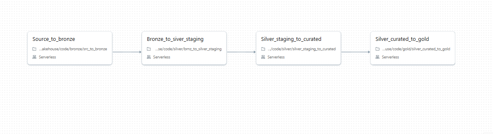
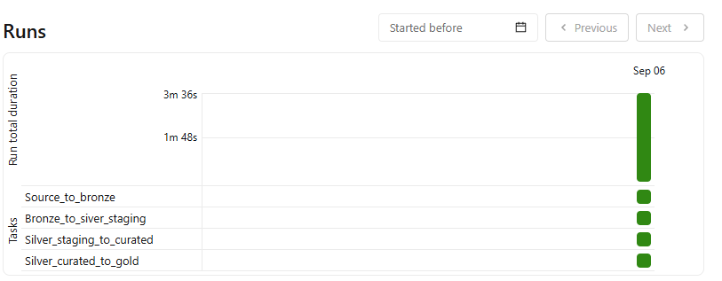

# Bike Lakehouse Pipeline

A data engineering project that builds a medallion-architecture (Bronze → Silver → Gold) pipeline for a biking dataset, ingesting from two source systems (CRM and ERP) and progressively cleaning, conforming, and curating the data.

## Project Structure

```
bikeLakehouse/
├── code/
│   ├── bronze/
│   │   ├── EDA_for_bronze.ipynb
│   │   ├── bronze_config.py
│   │   └── src_to_bronze.ipynb
│   ├── gold/
│   │   └── silver_curated_to_gold.ipynb
│   ├── silver/
│   │   ├── brnz_to_silver_staging.ipynb
│   │   ├── cleaning_functions.py
│   │   └── silver_staging_to_curated.ipynb
│   └── practice_spark.ipynb
└── dataset/
|    ├── crm/
|    ├── erp/
└── images/
```

## Data Sources

Data is ingested from two source systems:
- **CRM** – customer, product, and sales data
- **ERP** – customer and location data

## Pipeline Overview

### 1. Source → Bronze

Raw data is extracted from the CRM and ERP sources with no transformation, landing as-is into the bronze layer. This produces five tables:

- `customer_crm`
- `customer_erp`
- `location_erp`
- `product_category`
- `product_crm`
- `sales_crm`

#### Use Pyspark for the extraction logic

### 2. Bronze → Silver (Staging)

Two staging tables are used rather than one, since the transformation involved more than basic cleaning — each entity also needs to be validated and preserved on its own before curation. At this stage, for each table:

- Columns are renamed to user-friendly names
- Text columns are trimmed of leading/trailing spaces
- Coded values are standardized into readable labels (e.g. `M` → `Married`/`Male`, `S` → `Single`)

#### Use Pyspark for the data cleaning and transformation logic

### 3. Silver Staging → Silver Curated

**Customers**
- `customer_crm` and `location_erp` are joined into a single curated customer table for the CRM source.
- `customer_erp` is kept as its own standalone table. Verification showed it shares no `customer_key` with `customer_crm` or `location_erp`, so joining it in would require a full join and introduce a large number of nulls for non-overlapping columns.

**Products**
- The `product_key` column in `product_crm` is split, since it was a composite of two attributes: the category ID and the actual product key used in `sales_crm`.

#### Use Pyspark for the data cleaning and transformation logic

### 4. Silver Curated → Gold

Curated silver data is aggregated/modeled into the gold layer for consumption (see `silver_curated_to_gold.ipynb`).


#### Use SQL for the data modeling logic
We have tables: customers, products, date as dimension tables and our sales as a fact table

## Job Orchestration

**Job with tasks:**



**Successful job run:**

